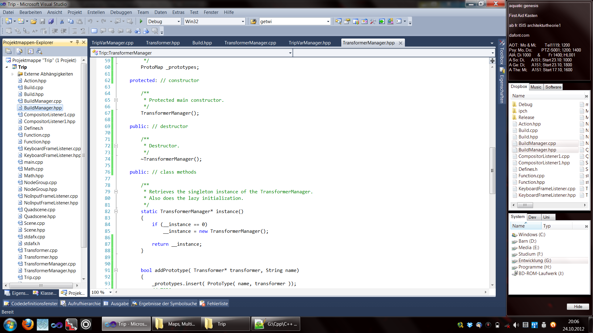

# barn-sidebar
A stylish side bar for Desktops of the `Windows` operating system.
- author: andreasl (andreas@langenhagen.cc)
- version: 19-04-27

**The project is not maintained anymore.**

A cool sidebar that occupies an adjustable part of the screen or slide in/out of the screen when the
mouse moves to the screens edge.
When the sidebar is set to be sticky, other windows will, when maximized, align with the sidebar so
that the sidebar and the respective windows share the whole screen.
The sidebar contains a textbox for notes and several explorer-views into the file system.
The explorer-views support as good as all capabilities that an explorer window supports, including
drag & drop and interoperability with other windows.
I happily used this tool when working with `Windows 7`.

## Usage
The sidebar and its options are always accessible via an icon in the system tray.
When hidden, other maximized windows will automatically occupy the free space and re-adjust, when
the sidebar is shown again.
The sidebar can also be configured to automatically hide when the mouse moves out of its area. When
the mouse moves towards the screen's edge, the sidebard will slide in again.
A very small bar can be configured to peek the into the screen when the side bar is hidden.

The sidebar's text box retains content across sessions.
It can be used as a sticky note.

The explorer-views can be used like the usual windows explorer.
They can interoperate with other windows, e.g via drag & drop.
They also support usual explorer shortcuts, e.g. `ctrl+c` and `ctrl+v` for copying and pasting
files.

### Configurability
The sidebar's appearance can be configured with regard to several aspects.

The sidebar can be configured to either stick to a screen's edge or slide into the screen when the
mouse moves to the screen's edge and slide out of the screen when the mouse moves away from the
sidebar. Which mode is chosen can be configured via the settings menu.
The same holds for the timings and speed for fade in/fade out animations.

The sidebar's size, color and transparency can also be set.

## TODO
- the sidebar is taylored to 1920x1080 pixel screens. For a smaller screen resolution I created a
  hacky project, `Sidebar_Small`. Make the sidebar screen size agnostic
- comboboxes for  explorer-view - choice of symbol size
- make explorer views symbol size changeable:
    - details
    - icon
    - list
    - smallicon
    - thumbnail
    - thumbstrip
    - tile
- adjustable Hidden Bar size
- make hidden bar not a Windows Form but just a rectangle
- Adjustable position of sidebar
- Change, that `SettingsForm` does not stay the main form and always has to be loaded.
- disposal of `AboutForm`, `SettingsForm`
- use `const`/`readonly`
- `drag`/`drop` workaround
- when the sidebar is hidden, make it still openable
- `hide` does not hide in full screen
- adjustable opacity of hidden bar
- fonts!
